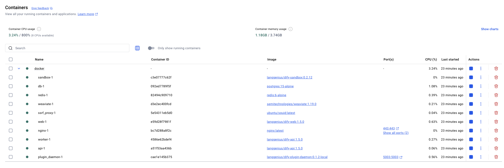
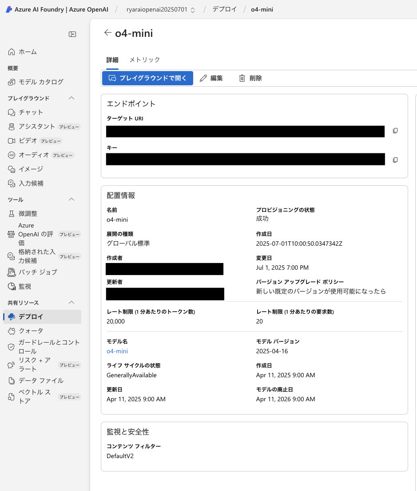
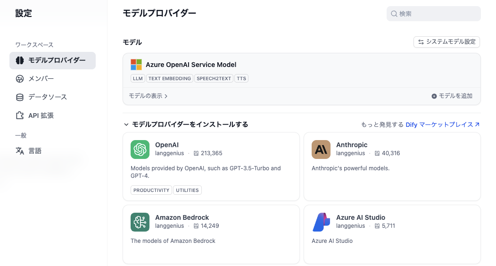
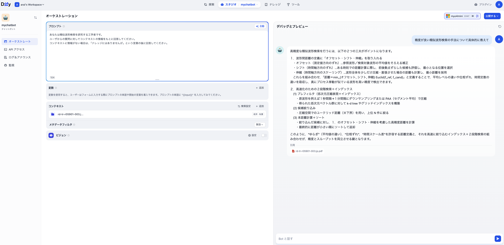

# mydify

## ローカルマシン
|項目|バージョン|
|---|---|
|OS|macOS 15.5|
|チップ|Appple M1|
|メモリ|8 GB|
|Docker Desktop|Version 4.40|
|Docker Engine|28.0.4|
|Docker Compose|v2.34.0-desktop.1|

## コンテナ立ち上げまで
コミュニティ版のリポジトリをクローンして、READMEの通りに実行する。
```
git clone https://github.com/langgenius/dify.git
cd dify
cd docker
cp .env.example .env
docker compose up -d
```
下記のようにコンテナが立ち上がる（非常にたくさんの要素で構成されている模様）


## 即席RAG構築
### LLMの調達
Azure OpenAIでo4-miniを調達しました。


このo4-miniをローカルDifyのモデルプロバイダーに設定しました。


### ナレッジの登録
類似波形検索を題材にして、インターネット上に公開されているPDFを使用しました。
ローカルでのテキスト抽出、embeddingですが、1分かからず終わりました。

### チャットボット作成
ワークフローは組まずにチャットボット単体で作成しました。
PDFの内容を元に回答をしてくれているように見えます。

